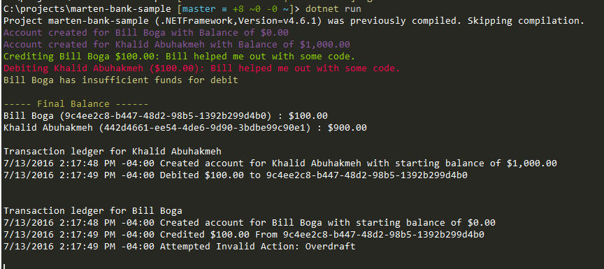

# Marten Bank Sample (Console)

This is a realy simple banking example using [Marten](https://github.com/JasperFx/marten) as an event store. There is the concept of `Created`, `Credit`, `Debit`, and `Invalid` events. This is a spike to see how I would build a bigger banking system on top of Marten.

## Getting Started

You just need the new [.NET Core Tooling](https://dot.net) and [PostgreSQL](https://www.postgresql.org/) installed and then run the following commands.

```command
> dotnet restore
> dotnet run 
```

Note: Remember to create the necessary database. You can use the docker-compose to spin up a test database.

You should see the following output:

